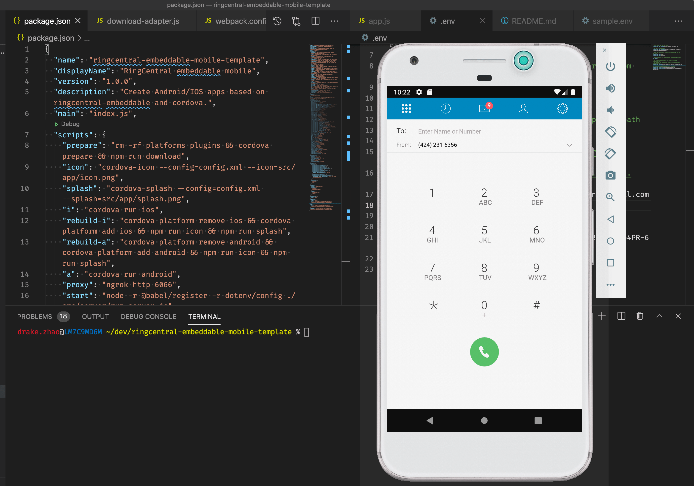
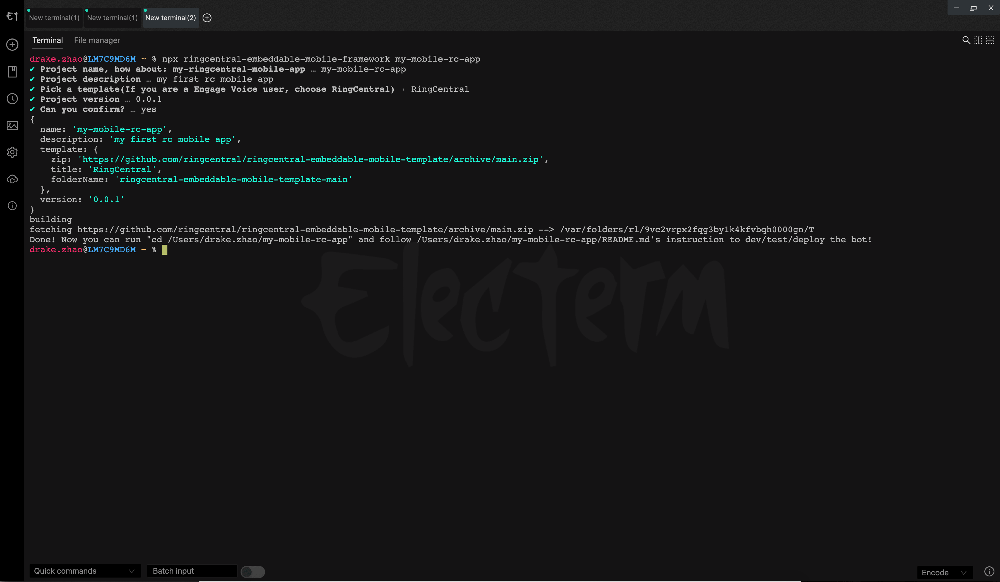

# RingCentral embeddable mobile framework

**Experimental** RingCentral embeddable mobile framework to create customized Android/IOS apps based on [ringcentral-embeddable](https://github.com/ringcentral/ringcentral-embeddable) and cordova



## Prerequisites

- Nodejs 8.10+/npm, recommend using [nvm](https://github.com/creationix/nvm) to install nodejs/npm.

## Use

Create a project with RingCentral embeddable mobile framework command line tool

```sh
npx ringcentral-embeddable-mobile-framework my-app
```

or

```sh
npm i -g ringcentral-embeddable-mobile-framework
ringcentral-embeddable-mobile-framework my-app
```

Then follow my-app/README.md to develop your apps



## Video demo

https://youtu.be/k7ovVgO5QlM

## License

MIT
