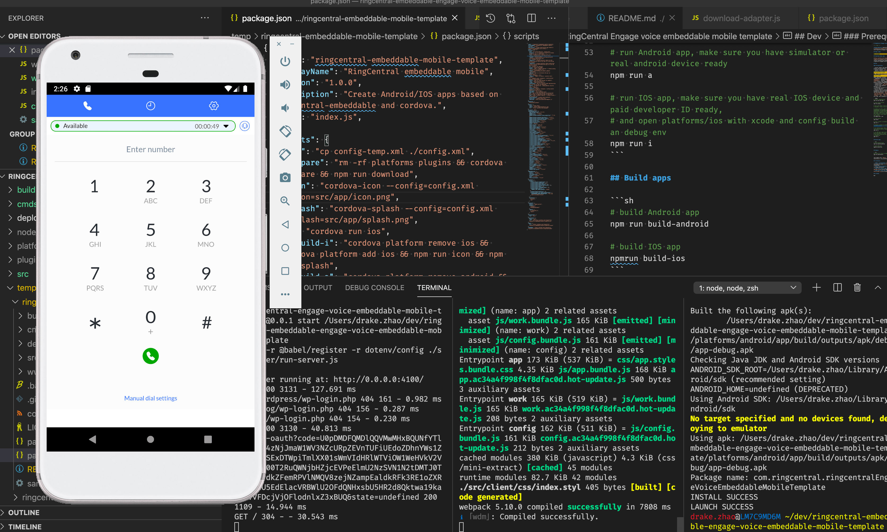

# RingCentral embeddable mobile framework

**Experimental** RingCentral embeddable mobile framework to create customized Android/IOS apps based on [ringcentral-embeddable](https://github.com/ringcentral/ringcentral-embeddable), [ringcentral-engage-voice-embeddable](https://github.com/ringcentral/engage-voice-embeddable) and cordova

For RingCentral users (ringcentral-embeddable)


For Engage Voice users (ringcentral-engage-voice-embeddable)



## Prerequisites

- Nodejs 8.10+/npm, recommend using [nvm](https://github.com/creationix/nvm) to install nodejs/npm.

## Use

Create a project with RingCentral embeddable mobile framework command line tool

```sh
npx ringcentral-embeddable-mobile-framework my-mobile-rc-app
```

or

```sh
npm i -g ringcentral-embeddable-mobile-framework
ringcentral-embeddable-mobile-framework my-app
```

Then follow my-app/README.md to develop your apps


## Video demo

https://youtu.be/k7ovVgO5QlM

## Real world projects

- RingCentral embeddable mobile template: [https://github.com/ringcentral/ringcentral-embeddable-mobile-template](https://github.com/ringcentral/ringcentral-embeddable-mobile-template)
- RingCentral engage voice embeddable mobile template: [https://github.com/ringcentral/ringcentral-engage-voice-embeddable-mobile-template](https://github.com/ringcentral/ringcentral-engage-voice-embeddable-mobile-template)
- RingCentral embeddable mobile demo: [https://github.com/ringcentral/ringcentral-embeddable-mobile](https://github.com/ringcentral/ringcentral-embeddable-mobile)
- RingCentral engage voice embeddable mobile demo: [https://github.com/ringcentral/ringcentral-engage-voice-embeddable-mobile](https://github.com/ringcentral/ringcentral-engage-voice-embeddable-mobile)

## License

MIT
